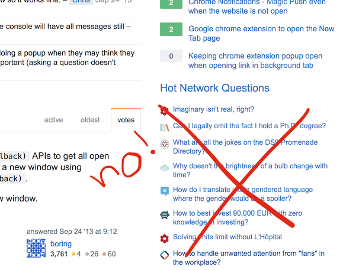

## KaiWeb
> For when the internet is both an amazing tool and an amazing distraction.

### Premise
I'm a software engineer. That means I sometimes get stuck on code problems, and when I'm stuck and frustrated I'm particularly vulnerable to distraction. Enter: StackOverflow's "Hot Network Questions." They have nothing to do with my current problem, and *other peoples' problems are so much more fun to think about than that thing that still isn't frickin' working!* But luckily, I'm a software engineer and get to experience the internet the way I want to. So I deleted the "Hot Network Questions".

Then I thought, what else can I delete or change to make the internet exactly how I want it?

### Results
I started out with a popup script, since that allowed me to configure or trigger the script manually. Unfortunately that also meant I had to click the extension, then click another button, for every tab I wanted to modify. By then I'd already seen the dreaded, extremely interesting divs. I instead switched to much a simpler, automatically running, content script.

This is very much a `[WIP]` but here's what I'm doing so far:

- Hide the above-mentioned "Hot Network Questions"
- Hide the GitHub `notfications` bell/indicator, since I'm an inbox-zero kind of person but I'm also on vacation, dangit.

Future:
I'd like to also add an `EXTREEEM MODE` which is activated using the popup, that will allow me to delete things like the twitter timeline, news sites content, hacker news comment threads, and other things which are so so tempting when looking at the internet is part of my job.

### Installation
- download this repository to your computer
- visit Chrome's extension page at chrome://extensions/
- ensure `Developer mode` is checked
- click `Load unpacked extension` and select your local copy of this repo
- you should see  appear in your toolbar!

### Learnings
Much of this can be accomplished using a built-in feature in adblocking extensions like uBlock, but most of the reason I did this was to learn how to write my own extensions. Here's some things I learned and might want to remember when I come back to the project (and you might find helpful, too!):

- background scripts vs content scripts vs popup scripts
    - popup scripts only run in the context of the extension's popup. That means print statements go to the popup's inspector, not the inspector of the tab you're on.
    - content scripts can directly modify the *content* of the DOM
    - popup scripts can be *injected into* the DOM using `chrome.tabs.executeScript()`. They're useful for controlling the script using configuration settings or buttons in the popup, rather than running the same way all the time. You may also need to change `permissions` in the `manifest.json` to give your script cross-orgin access to various pages.
- permissions and matching: One can configure which scripts run on which sites using url matching in the `manifest.json`. For right now the classes and ids that I'm keying off of are specific enough that I chose not to do this.
